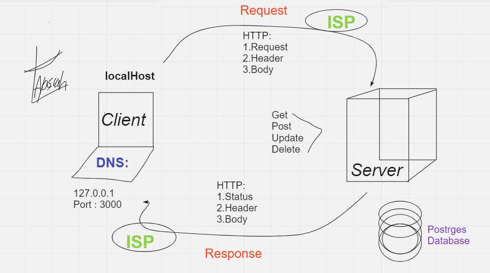

# Movies-Library - Version 1

**Author Name**: Zaid Ayasrah

## WRRC

## Overview

## Getting Started
Create a repository called Movies-Library on GitHub
Initialize your project by running the following command "npm init -y"
Create a new branch called Task11
Create basic file structure (server.js, .gitignore, .eslintrc.json )
Install the required packages for this task: npm install express cors

## Project Features
<!-- What are the features included in you app -->